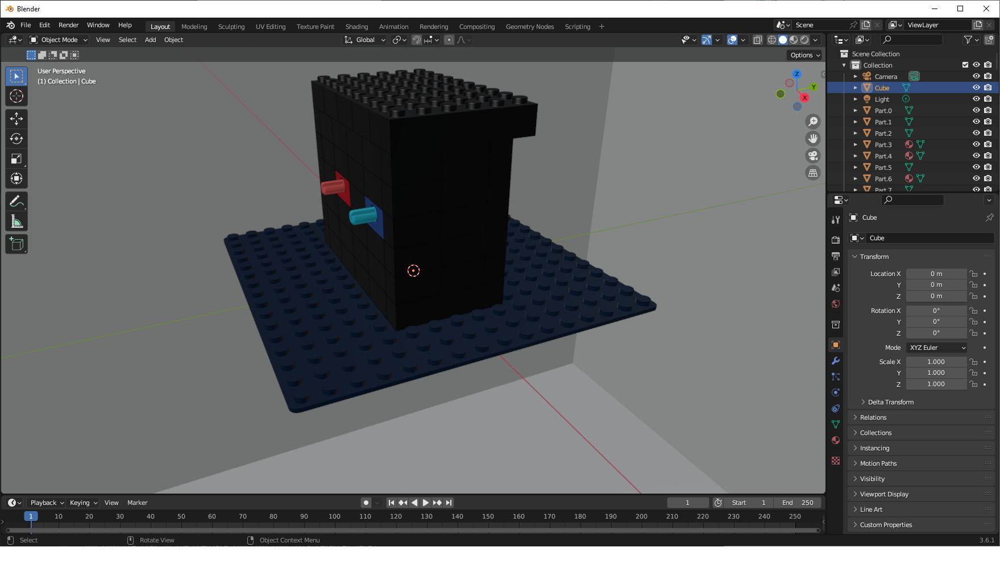

# Virtual Machine 0

- [Challenge information](#challenge-information)
- [Solution](#solution)
- [References](#references)

## Challenge information

```text
Level: Medium
Tags: picoCTF 2023, Reverse Engineering, Analog
Meta Tags: Walkthrough, Walk-through, Write-up, Writeup
Author: LT 'SYREAL' JONES
 
Description:
Can you crack this black box?

We grabbed this design doc from enemy servers: Download. 

We know that the rotation of the red axle is input and the rotation of the blue axle is output. 
The following input gives the flag as output: Download.
 
Hints:
1. Rotating the axle that number of times is obviously not feasible. 
   Can you model the mathematical relationship between red and blue?
```

Challenge link: [https://play.picoctf.org/practice/challenge/385](https://play.picoctf.org/practice/challenge/385)

## Solution

Unzipping the given Zip-file gives you a .dae file. A format I had previously never heard about.
So I googled for a program to open it with and found [Blender](https://www.blender.org/) which is free and open source.  

### Physically dismantle the machine

Start Blender.  
Then in the `File` menu, choose `Import` and `Collada (.dae)`.  Select the `Virtual-Machine-0.dae` file.

Zoom in and you should see the "black box" machine



Now you need to dismantle the black box by selecting components and moving them away.
The navigation is a bit wierd and this takes time.

You need to isolated the red and blue gearwheels good enough to be able to count their number of cogs.

The blue gear has 8 cogs and the red gear has 40 cogs.

### Get the flag

The difference in the number of cogs is 5 (40 / 8 = 5).

Then calculate an assumed hex-encoded flag in Python

```python
>>> input = 39722847074734820757600524178581224432297292490103996089444214757432940313
>>> difference = 5
>>> hex_flag = hex(input * difference)[2:]
>>> bytes.fromhex(hex_flag).decode()
'picoCTF{<REDACTED>}'
>>> 
```

For additional information, please see the references below.

### References

- [Blender - Homepage](https://www.blender.org/)
- [python - Linux manual page](https://linux.die.net/man/1/python)
- [Python (programming language) - Wikipedia](https://en.wikipedia.org/wiki/Python_(programming_language))
