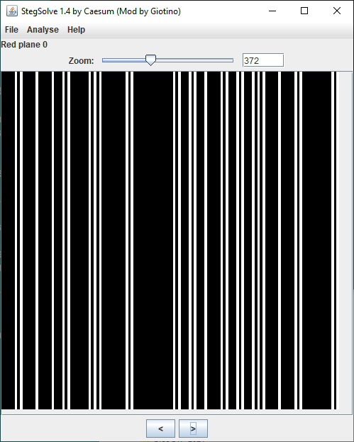

# RED

- [Challenge information](#challenge-information)
- [Python Solution](#python-solution)
- [Zsteg Solution](#zsteg-solution)
- [References](#references)

## Challenge information

```text
Level: Easy
Tags: Forensics, picoCTF 2025, browser_webshell_solvable
Meta Tags: Walkthrough, Walk-through, Write-up, Writeup
Author: Shuailin Pan (LeConjuror)

Description:
RED, RED, RED, RED
Download the image: red.png

Hints:
1. The picture seems pure, but is it though?
2. Red?Ged?Bed?Aed?
3. Check whatever Facebook is called now.
```

Challenge link: [https://play.picoctf.org/practice/challenge/460](https://play.picoctf.org/practice/challenge/460)

## Python Solution

### Check the file in StegSolve

We start by checking the picture in [StegSolve](https://github.com/Giotino/stegsolve).  
From the `Red plane 0` view we can see that there is information encoded in the image.



Similar patterns are found in `Green plane 0`, `Blue plane 0`, and `Alpha plane 0`.

### Check for exif data

Next, we check for exif data with `exiftool`

```bash
┌──(Pillow)─(kali㉿kali)-[/mnt/…/picoCTF/picoCTF_2025/Forensics/RED]
└─$ exiftool red.png                                  
ExifTool Version Number         : 13.10
File Name                       : red.png
Directory                       : .
File Size                       : 796 bytes
File Modification Date/Time     : 2025:04:12 17:39:36+02:00
File Access Date/Time           : 2025:04:12 17:40:04+02:00
File Inode Change Date/Time     : 2025:04:12 17:39:36+02:00
File Permissions                : -rwxrwxrwx
File Type                       : PNG
File Type Extension             : png
MIME Type                       : image/png
Image Width                     : 128
Image Height                    : 128
Bit Depth                       : 8
Color Type                      : RGB with Alpha
Compression                     : Deflate/Inflate
Filter                          : Adaptive
Interlace                       : Noninterlaced
Poem                            : Crimson heart, vibrant and bold,.Hearts flutter at your sight..Evenings glow softly red,.Cherries burst with sweet life..Kisses linger with your warmth..Love deep as merlot..Scarlet leaves falling softly,.Bold in every stroke.
Image Size                      : 128x128
Megapixels                      : 0.016
```

The `Poem` information looks weird! Let's look closer on each line of it like this

```bash
┌──(Pillow)─(kali㉿kali)-[/mnt/…/picoCTF/picoCTF_2025/Forensics/RED]
└─$ exiftool -T -Poem red.png | tr '.' '\n'
Crimson heart, vibrant and bold,
Hearts flutter at your sight

Evenings glow softly red,
Cherries burst with sweet life

Kisses linger with your warmth

Love deep as merlot

Scarlet leaves falling softly,
Bold in every stroke
```

Here we note that the first letter on each line becomes `CHECKLSB` or more clearly `Check LSB`.  
`LSB` as in [Least Significant Bit](https://en.wikipedia.org/wiki/Bit_numbering).

### Write a extraction script

Next, we write a small extraction script in Python and [Pillow](https://pypi.org/project/Pillow/)

```python
#!/usr/bin/env python

from PIL import Image
from base64 import b64decode

image = Image.open("red.png")
image = image.convert("RGBA")

width, height = image.size

# Read the LSB-bit of each channel in the image for the first row only
bin_array = []
for y in range(1):
    for x in range(width):
        channel = image.getpixel((x, y))
        bin_array.append(str(channel[0] & 1))  # Red
        bin_array.append(str(channel[1] & 1))  # Green
        bin_array.append(str(channel[2] & 1))  # Blue
        bin_array.append(str(channel[3] & 1))  # Alpha

bin_string = "".join(bin_array)

# Divide the binary string into an array of 8-bit binary string chunks
n = 8
split_array = [bin_string[i:i+n] for i in range(0, len(bin_string), n)]

# Convert to ascii text and base64-decode
flag = ""
for item in split_array:
    flag += chr(int(item, 2))
print(b64decode(flag).decode())
```

It took some trial-and-error to figure out that:

- The encoded information is the same on each row of the image, so only one row needs to be read
- The flag is Base64-encoded

### Get the flag

Finally, we run the script to get the flag

```bash
┌──(kali㉿kali)-[/mnt/…/picoCTF/picoCTF_2025/Forensics/RED]
└─$ source ~/Python_venvs/Pillow/bin/activate

┌──(Pillow)─(kali㉿kali)-[/mnt/…/picoCTF/picoCTF_2025/Forensics/RED]
└─$ ./get_flag.py              
picoCTF{<REDACTED>}
```

## Zsteg Solution

### Search with all methods

Alternatively, we can use `zsteg` to search with all methods. Install it with `sudo gem install zsteg` if needed.

```bash
┌──(kali㉿kali)-[/mnt/…/picoCTF/picoCTF_2025/Forensics/RED]
└─$ zsteg -a red.png 

<---snip--->
meta Poem           .. text: "Crimson heart, vibrant and bold,\nHearts flutter at your sight.\nEvenings glow softly red,\nCherries burst with sweet life.\nKisses linger with your warmth.\nLove deep as merlot.\nScarlet leaves falling softly,\nBold in every stroke."                                                                                                              
b1,rgba,lsb,xy      .. text: "cGljb0NURntyM2RfMXNfdGgzX3VsdDFtNHQzX2N1cjNfZjByXzU0ZG4zNTVffQ==cGljb0NURntyM2RfMXNfdGgzX3VsdDFtNHQzX2N1cjNfZjByXzU0ZG4zNTVffQ==cGljb0NURntyM2RfMXNfdGgzX3VsdDFtNHQzX2N1cjNfZjByXzU0ZG4zNTVffQ==cGljb0NURntyM2RfMXNfdGgzX3VsdDFtNHQzX2N1cjNfZjByXzU0ZG4zNTVffQ=="                                                                                       
b1,rgba,msb,xy      .. file: OpenPGP Public Key
b2,g,lsb,xy         .. text: "ET@UETPETUUT@TUUTD@PDUDDDPE"
b2,rgb,lsb,xy       .. file: OpenPGP Secret Key
b2,bgr,msb,xy       .. file: OpenPGP Public Key
b2,rgba,lsb,xy      .. file: OpenPGP Secret Key
b2,rgba,msb,xy      .. text: "CIkiiiII"
<---snip--->
```

We note the long and repeating string that looks base64-encoded in the beginning of the rather long output.

Next, we try to extract only the first part

```bash
┌──(kali㉿kali)-[/mnt/…/picoCTF/picoCTF_2025/Forensics/RED]
└─$ zsteg -E '1b,rgba,lsb' red.png | cut -c1-68
cGljb0NURntyM2RfMXNfdGgzX3VsdDFtNHQzX2N1cjNfZjByXzU0ZG4zNTVffQ==cGlj

┌──(kali㉿kali)-[/mnt/…/picoCTF/picoCTF_2025/Forensics/RED]
└─$ zsteg -E '1b,rgba,lsb' red.png | cut -c1-64
cGljb0NURntyM2RfMXNfdGgzX3VsdDFtNHQzX2N1cjNfZjByXzU0ZG4zNTVffQ==
```

### Get the flag again

Finally, we base64-decode the string and get the flag

```bash
┌──(kali㉿kali)-[/mnt/…/picoCTF/picoCTF_2025/Forensics/RED]
└─$ zsteg -E '1b,rgba,lsb' red.png | cut -c1-64 | base64 -d
picoCTF{<REDACTED>}   
```

For additional information, please see the references below.

## References

- [ASCII - Wikipedia](https://en.wikipedia.org/wiki/ASCII)
- [base64 - Linux manual page](https://man7.org/linux/man-pages/man1/base64.1.html)
- [Base64 - Wikipedia](https://en.wikipedia.org/wiki/Base64)
- [Bit numbering - Wikipedia](https://en.wikipedia.org/wiki/Bit_numbering)
- [cut - Linux manual page](https://man7.org/linux/man-pages/man1/cut.1.html)
- [Exif - Wikipedia](https://en.wikipedia.org/wiki/Exif)
- [ExifTool - Homepage](https://exiftool.org/)
- [exiftool - Linux manual page](https://linux.die.net/man/1/exiftool)
- [ExifTool - Wikipedia](https://en.wikipedia.org/wiki/ExifTool)
- [PNG - Wikipedia](https://en.wikipedia.org/wiki/PNG)
- [python - Linux manual page](https://linux.die.net/man/1/python)
- [Python (programming language) - Wikipedia](https://en.wikipedia.org/wiki/Python_(programming_language))
- [Python Imaging Library - Pillow - Documentation](https://pillow.readthedocs.io/en/stable/)
- [Python Imaging Library - Pillow - Homepage](https://python-pillow.github.io/)
- [Python Imaging Library - Pillow - PyPI](https://pypi.org/project/Pillow/)
- [Steganography - Wikipedia](https://en.wikipedia.org/wiki/Steganography)
- [stegsolve 1.4 - GitHub](https://github.com/Giotino/stegsolve)
- [tr - Linux manual page](https://man7.org/linux/man-pages/man1/tr.1.html)
- [zsteg - GitHub](https://github.com/zed-0xff/zsteg)
