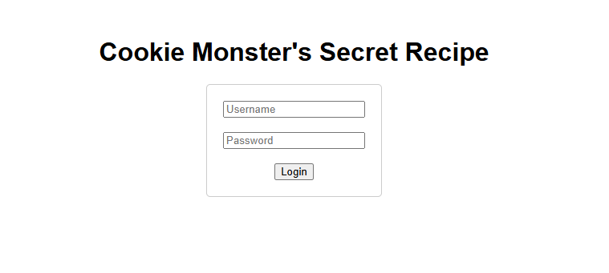

# Cookie Monster Secret Recipe

- [Challenge information](#challenge-information)
- [Solution](#solution)
- [References](#references)

## Challenge information

```text
Level: Easy
Tags: Web Exploitation, picoCTF 2025, browser_webshell_solvable
Meta Tags: Walkthrough, Walk-through, Write-up, Writeup
Author: Brhane Giday and Prince Niyonshuti N.

Description:
Cookie Monster has hidden his top-secret cookie recipe somewhere on his website. 
As an aspiring cookie detective, your mission is to uncover this delectable secret. 
Can you outsmart Cookie Monster and find the hidden recipe?

You can access the Cookie Monster here and good luck

Hints:
1. Sometimes, the most important information is hidden in plain sight. 
   Have you checked all parts of the webpage?
2. Cookies aren't just for eating - they're also used in web technologies!
3. Web browsers often have tools that can help you inspect various aspects 
   of a webpage, including things you can't see directly.
```

Challenge link: [https://play.picoctf.org/practice/challenge/469](https://play.picoctf.org/practice/challenge/469)

## Solution

We browse to the web site and see the following



### Inspect the web page

Next, we right-click and select 'View page source' (or press CTRL + U) to get the HTML-source of the page.

```html
<!DOCTYPE html>
<html lang="en">
<head>
    <meta charset="UTF-8">
    <meta name="viewport" content="width=device-width, initial-scale=1.0">
    <title>Cookie Monster's Secret Recipe</title>
    <style>
        body { font-family: Arial, sans-serif; text-align: center; margin-top: 50px; }
        form { display: inline-block; padding: 20px; border: 1px solid #ccc; border-radius: 5px; }
    </style>
</head>
<body>
    <h1>Cookie Monster's Secret Recipe</h1>
    <form action="login.php" method="post">
        <input type="text" name="username" placeholder="Username" required><br><br>
        <input type="password" name="password" placeholder="Password" required><br><br>
        <input type="submit" value="Login">
    </form>
</body>
</html>
```

Nothing special here, such as an interesting username in a comment.

Let's try to login with admin:admin and see what happens.  
The result is:

```text
Access Denied
Cookie Monster says: 'Me no need password. Me just need cookies!'

Hint: Have you checked your cookies lately?

Go back
```

We should check for [HTTP cookies](https://en.wikipedia.org/wiki/HTTP_cookie).

### Check the cookies

Start DevTools in the browser by pressing `F12` or using `Ctrl + Shift + I`.  
Then select the `Application` tab and make sure `http://verbal-sleep.picoctf.net:56241` is
selected under `Cookies` in the menu to the left.

Note the string in the `Value` field (`cGljb0NURntjMDBrMWVfbTBuc3Rlcl9sMHZlc19jMDBraWVzXzZDMkZCN0YzfQ%3D%3D`) that looks Base64-encoded.  
The last 6 characters are two [URL-encoded](https://en.wikipedia.org/wiki/Percent-encoding) padding characters (`=`).

### Get the flag

We can decode the string with the `base64` tool (with `%3D%3D` replaced with `==`) in plain bash like this

```bash
┌──(kali㉿kali)-[/mnt/…/picoCTF/picoCTF_2025/Web_Exploitation/Cookie_Monster_Secret_Recipe]
└─$ echo 'cGljb0NURntjMDBrMWVfbTBuc3Rlcl9sMHZlc19jMDBraWVzXzZDMkZCN0YzfQ==' | base64 -d
picoCTF{<REDACTED>}
```

Or like this with `url` and `b64` from [Binary Refinery](https://binref.github.io/).

```bash
┌──(kali㉿kali)-[/mnt/…/picoCTF/picoCTF_2025/Web_Exploitation/Cookie_Monster_Secret_Recipe]
└─$ source ~/Python_venvs/Binary_Refinery/bin/activate

┌──(Binary_Refinery)─(kali㉿kali)-[/mnt/…/picoCTF/picoCTF_2025/Web_Exploitation/Cookie_Monster_Secret_Recipe]
└─$ emit 'cGljb0NURntjMDBrMWVfbTBuc3Rlcl9sMHZlc19jMDBraWVzXzZDMkZCN0YzfQ%3D%3D' | url | b64   
picoCTF{<REDACTED>}
```

And there we have the flag.

For additional information, please see the references below.

## References

- [base64 - Linux manual page](https://man7.org/linux/man-pages/man1/base64.1.html)
- [Base64 - Wikipedia](https://en.wikipedia.org/wiki/Base64)
- [Binary Refinery - Documentation](https://binref.github.io/)
- [Binary Refinery - Github](https://github.com/binref/refinery/)
- [DevTools - Chrome Docs](https://developer.chrome.com/docs/devtools/)
- [DevTools - Firefox User Docs](https://firefox-source-docs.mozilla.org/devtools-user/)
- [DevTools - MDN](https://developer.mozilla.org/en-US/docs/Learn_web_development/Howto/Tools_and_setup/What_are_browser_developer_tools)
- [HTML - Wikipedia](https://en.wikipedia.org/wiki/HTML)
- [HTTP cookie - Wikipedia](https://en.wikipedia.org/wiki/HTTP_cookie)
- [Percent-encoding - Wikipedia](https://en.wikipedia.org/wiki/Percent-encoding)
